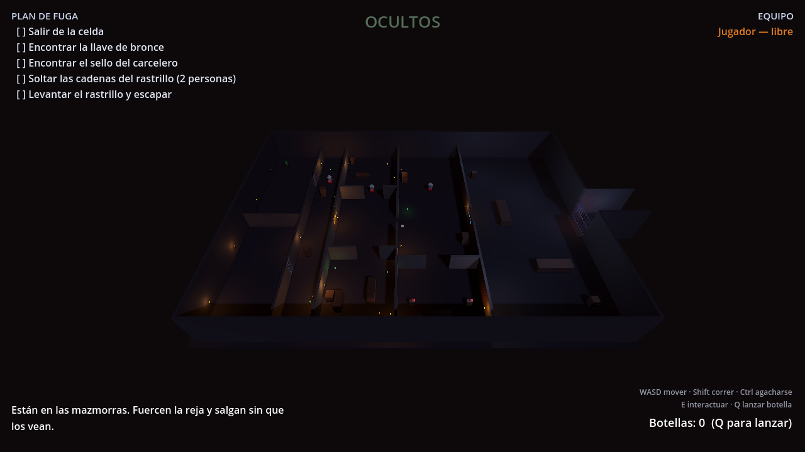

# Fuga

Juego cooperativo de sigilo y escape para 2–8 jugadores por internet, hecho con
**Godot 4.4**. Todos los jugadores son rehenes encerrados en un complejo y deben
cooperar para salir sin que los guardias los descubran.



## Descargar y jugar

No hace falta instalar nada más: descarga el ZIP de tu sistema, descomprímelo y
haz doble clic.

**[⬇ Descargar la última versión](https://github.com/kamyee02-del/Juego-steam/releases/latest)**
· Windows, Mac y Linux

**[📄 Guía paso a paso en PDF](docs/Guia-Fuga.pdf)** — cómo descargarlo,
cómo pasar el aviso de seguridad de Windows y de Mac, y cómo conectaros entre
vosotros. Pensada para reenviársela a tus amigos tal cual.

> La primera vez, Windows y macOS avisan de que la aplicación no está firmada.
> Es normal en cualquier programa sin certificado de pago; la guía explica cómo
> continuar en cada sistema.

## Cómo se juega

Empiezan encerrados en la celda norte. El plan de fuga es este:

1. **Forzar la reja** de la celda (hay que mantener pulsada la tecla, así que
   alguien debería vigilar mientras tanto).
2. **Encontrar la llave de bronce** — cambia de sitio cada partida, suele estar
   en el almacén. Abre la puerta del bloque de celdas.
3. **Encontrar la tarjeta de seguridad** — está en la sala de guardias. Abre la
   puerta que da al patio.
4. **Cortar la corriente** en la sala del generador. Hay dos palancas separadas
   y **las dos tienen que mantenerse pulsadas a la vez por dos personas
   distintas**: nadie puede hacerlo en solitario.
5. **Abrir el portón** del fondo y cruzar la salida.

Si un guardia te ve, te persigue; si te alcanza, te encierra en la celda sur y
un compañero tiene que ir a liberarte. La partida se pierde solo cuando no queda
nadie libre; si alguien llegó a salir, cuenta como fuga parcial.

### Controles

| Tecla | Acción |
|---|---|
| `WASD` | Moverse |
| `Shift` | Correr (rápido pero hace mucho ruido) |
| `Ctrl` / `C` | Agacharse (lento y silencioso, más difícil de ver) |
| `E` | Interactuar (algunas acciones hay que mantenerlas) |
| `Q` | Lanzar una botella para distraer a los guardias |
| `Ratón` | Girar la cámara |
| `Esc` | Liberar/capturar el ratón |

### Sigilo

- Los guardias tienen un **cono de visión** que verás dibujado en el suelo:
  amarillo mientras patrullan, naranja cuando sospechan, rojo cuando te
  persiguen. No te ven a través de las paredes.
- **El ruido importa**: correr te delata a 15 metros, caminar a 6, agacharse no
  hace ruido. Una botella lanzada arma escándalo a 22 metros del impacto y es
  la mejor forma de sacar a un guardia de su ruta.
- **Escóndete** en armarios, cajas, barriles y bajo los escritorios. Dentro no
  te ven, pero tampoco puedes moverte. Pulsa `E` otra vez para salir.

## Jugar con tus amigos

Hay dos formas de conectarse, y ambas funcionan con el mismo juego.

### Por Steam (lo más cómodo)

Requiere el addon GodotSteam instalado (ver más abajo) y tener Steam abierto.
Uno crea la partida con **"Crear partida (Steam)"** e invita a los demás desde
el overlay de Steam (`Shift+Tab` → lista de amigos → invitar). Los invitados
solo tienen que aceptar. No hace falta ninguna IP ni abrir puertos.

### Por IP directa (funciona sin Steam)

El anfitrión pulsa **"Crear partida (IP directa)"**. Los demás escriben su IP y
pulsan **"Unirse (IP)"**.

- **En la misma casa/wifi**: usad la IP local del anfitrión (algo como
  `192.168.1.50`). Funciona sin configurar nada.
- **Por internet**: el anfitrión necesita abrir el puerto **7777 (UDP)** en su
  router, o usar un programa de red virtual tipo Radmin VPN, ZeroTier o
  Tailscale — con eso os veis como si estuvierais en la misma red y no hay que
  tocar el router.

## Ejecutar el proyecto

1. Descarga **Godot 4.4** (versión estándar, no la de .NET) de
   [godotengine.org](https://godotengine.org/download).
2. Abre Godot, pulsa *Importar* y elige el archivo `project.godot` de esta
   carpeta.
3. Pulsa **F5** para jugar.

Para probar tú solo con dos ventanas, en Godot ve a
*Depurar → Ejecutar múltiples instancias → 2 instancias* y dale a F5: una hace
de anfitrión y en la otra te unes a `127.0.0.1`.

También puedes lanzarlas desde la terminal:

```bash
# Anfitrión (inicia la partida solo, a los 5 segundos)
godot --path . -- --host --name=Anfitrion --autostart=5

# Amigo
godot --path . -- --join=127.0.0.1 --name=Amigo
```

## Exportar el ejecutable

En Godot: *Proyecto → Exportar*. Ya hay presets preparados para Windows, Linux y
macOS. La primera vez Godot te pedirá descargar las *plantillas de exportación*
(*Editor → Gestionar plantillas de exportación → Descargar*).

El ejecutable resultante es lo que compartes con tus amigos si jugáis por IP
directa. Junto al `.exe` debe ir el archivo `steam_appid.txt` si quieres las
funciones de Steam.

## Añadir la integración de Steam

El código ya está preparado: `scripts/autoload/network.gd` detecta si GodotSteam
está instalado y activa las opciones de Steam en el menú. Si no lo está, el
juego funciona igual por IP directa. Para activarlo:

1. Descarga **GodotSteam GDExtension** desde
   [github.com/GodotSteam/GodotSteam](https://github.com/GodotSteam/GodotSteam/releases)
   (la versión que corresponda a Godot 4.4) y el complemento
   **SteamMultiplayerPeer** desde
   [github.com/expressobits/steam-multiplayer-peer](https://github.com/expressobits/steam-multiplayer-peer/releases).
2. Copia ambos dentro de la carpeta `addons/` del proyecto.
3. Cierra y vuelve a abrir Godot.
4. Ten Steam abierto al ejecutar el juego. Con el `steam_appid.txt` que ya está
   en el repositorio (AppID **480**, el juego de pruebas SpaceWar) las
   invitaciones ya funcionan entre amigos, gratis y sin registrarte en nada.

## Publicar en Steam

Cuando el juego esté como quieras:

1. Regístrate en [partner.steamgames.com](https://partner.steamgames.com) y paga
   la cuota de **100 USD** por el AppID (se recupera si el juego vende).
2. Sustituye el `480` de `steam_appid.txt` y la constante `STEAM_APP_ID` de
   `scripts/autoload/network.gd` por tu AppID real.
3. Rellena la ficha de la tienda (capturas, descripción, precio) y espera la
   revisión de Valve.
4. Sube las compilaciones con **SteamPipe** (`steamcmd` + un script de
   `app_build`), tal como explica la documentación de Steamworks.

## Estructura del proyecto

```
project.godot              Configuración, controles y capas de física
scenes/
  main_menu.tscn           Menú principal y sala de espera
  level_01.tscn            El complejo (la geometría se genera por código)
  player.tscn              El rehén: movimiento, cámara e interacción
  guard.tscn               El guardia: navegación, visión y oído
  bottle.tscn              Botella lanzable
  hud.tscn                 Interfaz de la partida
scripts/
  autoload/network.gd      Conexión: ENet (IP) y Steam tras la misma API
  autoload/game_state.gd   Estado compartido: jugadores, objetivos, alerta
  level.gd                 Construye el mapa y arbitra la partida
  player/player.gd         Control del rehén
  guard/guard.gd           IA del guardia (patrulla, sospecha, persecución)
  interactables/           Puertas, rejas, llaves, escondites, palancas, portón
  ui/                      Menú y HUD
  dev/sim_runner.gd        Pruebas automáticas (no se incluye al exportar)
```

El servidor (el jugador que hospeda) es la autoridad: decide capturas, rescates
y escapes. Cada cliente controla el movimiento de su propio personaje.

## Pruebas automáticas

El proyecto trae un arnés que juega una partida entera sin teclado ni pantalla,
útil para comprobar que nada se rompió al tocar el código:

```bash
# Plan de fuga completo (llaves, puertas, escondites, palancas, rescate, salida)
godot --headless --path . -- --host --autostart=5 --sim &
godot --headless --path . -- --join=127.0.0.1 --sim

# Detección y captura de los guardias
godot --headless --path . -- --host --autostart=5 --sim --sim-guards &
godot --headless --path . -- --join=127.0.0.1
```

Imprime una línea `OK`/`FALLO` por comprobación y termina con código de salida
distinto de cero si algo falla. Añade `--diag` para ver cada 3 segundos dónde
están los jugadores y los guardias.

## Ideas para seguir

- **Modo con un jugador de captor**: un amigo controla al jefe de los
  secuestradores en vez de dejarlo todo a la IA. La red ya lo permite: sería
  otro personaje con un rol distinto.
- Más mapas, cámaras de seguridad, linternas, tiempo límite, o guardias que
  cierren las puertas que encuentren abiertas.
